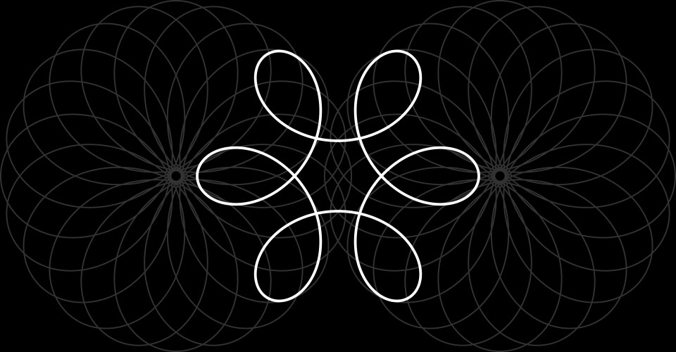

## MDDN 242 Project 1: Time-based Media

For this project, I produced a simple 12 hour clock showing hours, minutes and seconds. The inner circle and hand represents hours, centre circle and hand minutes, and outer circle seconds with a moving point. Using global variables, the clock colours are able to be easily changed, as well as the clock size and scaling of the hour and minute circles.

___

### PROGRESS DOCUMENTATION

##### **26/02/24 - 03/03/24 [W1]**

- Exploring ideas and sketching possible options for Project 1: Time-based media
- Experimenting with the p5.js framework
- Started working on `maeda_clock.js`

___

##### **04/03/24 - 10/03/24 [W2]**

- Sketching ideas for main clock
- Started working on `clock.js`
- Completed `maeda_clock.js`

Further exploration of clock ideas lead me to a concept in which a geometric "spirograph-like" graphic could be drawn as time progresses. There could be either; multiple different spirographs to represent different units of time; or a single spirograph that, for example, completes segments every minute and a whole rotation every hour.

Sketch of possible clock idea

Completed maeda clock

___

##### **11/03/24 - 17/03/24 [W3]**

- Continuation of development on `clock.js`
- Experimenting with new clock ideas

After creating a p5.js draft, I realised that, while it was possible to create a spirograph in p5.js, turning it into a clock was not a practical way of displaying the time in a format that is readable. With the clock framework we are using, I wasn't able to work out a way to display previous hours, minutes, and seconds passed, and so when the code is run, it begins to generate the clock from the current point in time. This wouldn't work as not being able to see the previous time passed, there was no basis to read from. It also appeared too messy as shown below.

Actual code output run for ~90 seconds

Code debug output - example showing different circle sizes representing milliseconds, seconds and minutes

___

##### **18/03/24 - 21/03/24 [W4]**

- Completed base code for new clock idea
- Continued iterations and completion of `clock.js`
- Added progress images to folder 'documentation images'

I tried to incorporate a colour change for the background to smoothly transition to the alarm colour using the following code (where '9' is the target hue, '13' is the range of change and '30' the countdown seconds):

`let bgColourCountdownHue = 9 + obj.seconds_until_alarm * 13 / 30;`

This didn't function as intended when the countdown timer was started at a value less than 30, as it would jump to a value that is part way through the transition. I amended '30' for `obj.seconds_until_alarm`, but this wouldn't work as it would output a constant value that wouldn't change with the countdown seconds. I also tried it using the equivalent maths in a map() function but would behave the same.

`var bgColourCountdownHue = map(obj.seconds_until_alarm, 0, 30, 9, 22);`

Base code completed for new clock idea

I settled on a two colour palette to keep it simple. When the alarm goes off, the colours invert every second until it stops.

Final design

Alarm going off
.jpg>)